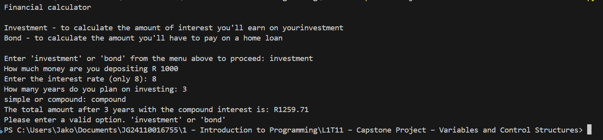
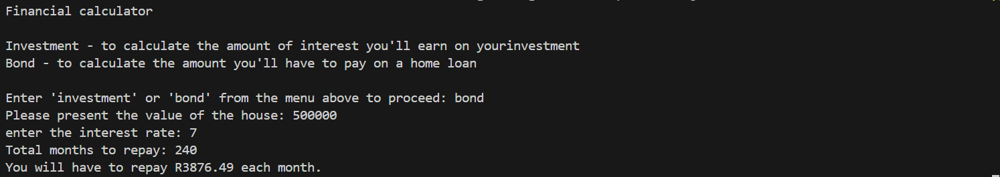

# Financial Calculator

## Description
The **Financial Calculator** is a Python-based tool that helps users calculate:
- The total returns on investments using **simple or compound interest**.
- The monthly repayment amount for a **home loan (bond)**.

This tool is useful for individuals who want to make informed financial decisions regarding savings and loans.

## Table of Contents
- [Installation](#installation)
- [Usage](#usage)
- [Examples](#examples)
- [Credits](#credits)

## Installation
To run this project on your computer, follow these steps:

1. **Ensure you have Python installed**  
   - Download and install Python from [python.org](https://www.python.org/downloads/).

2. **Clone the repository**  
   - Using Git:  
     ```bash
     git clone https://github.com/Buckshot18/CompulsoryTask2-L3T06
     ```
   - Or download the ZIP file and extract it.

3. **Navigate to the project folder**  
   ```bash
   cd financial-calculator

## Run the Script
1. Type the following in the command line
   python financial_calculator.py

## Usage
   After running the script, you will be prompted to choose between Investment or Bond
   
  **Investment calculation** 
  1. Enter the deposit amount.
  2. Provide the interest rate.
  3. Specify the investment duration (in years).
  4. Choose either simple or compound interest.
  5. The program calculates and displays the total amount after the given period.

  **Bond (Loan Repayment) Calculation**
  1. Enter the house value.
  2. Provide the annual interest rate.
  3. Specify the repayment period in months.
  4. The program calculates and displays your monthly repayment.

## Examples

### Investment Example:
Financial calculator

Investment - to calculate the amount of interest you'll earn on your investment
Bond - to calculate the amount you'll have to pay on a home loan

Enter 'investment' or 'bond' from the menu above to proceed: investment
How much money are you depositing R 1000
Enter the interest rate (only 8): 5
How many years do you plan on investing: 3
simple or compound: compound
The total amount after 3 years with the compound interest is: R1157.63



### Bond Example:
Enter 'investment' or 'bond' from the menu above to proceed: bond
Please present the value of the house: 500000
Enter the interest rate: 7
Total months to repay: 240
You will have to repay R3878.64 each month.



## Credits
Author: Jako Gelderblom
GitHub: https://github.com/Buckshot18


  
  
